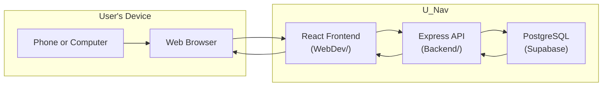
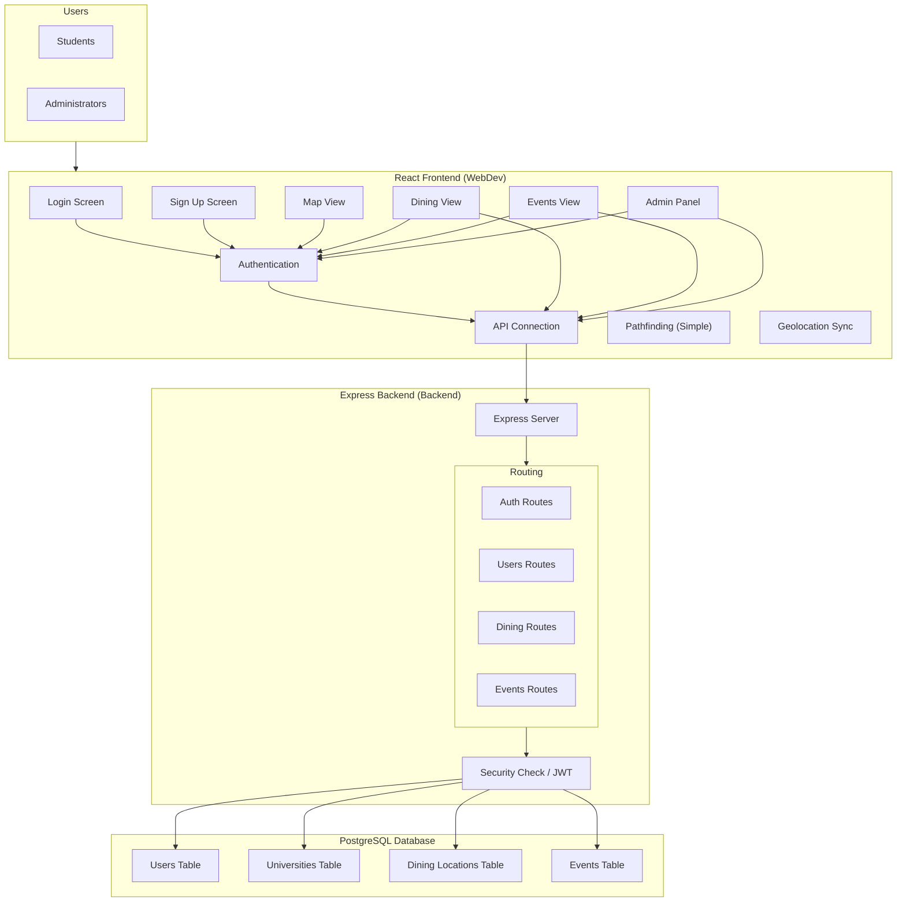
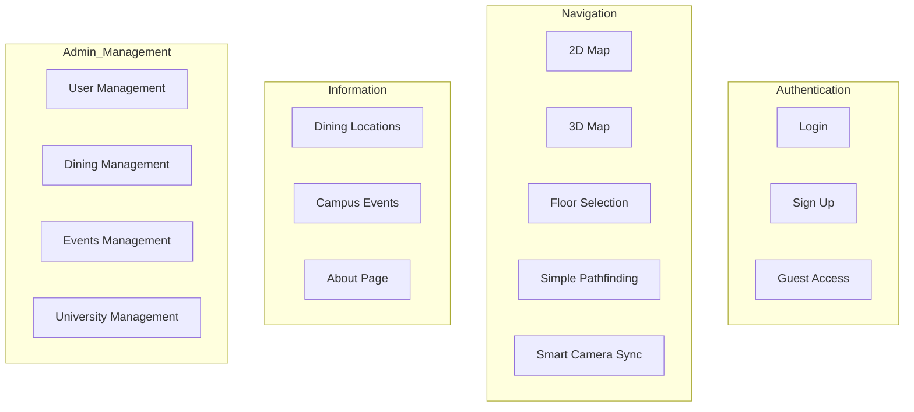
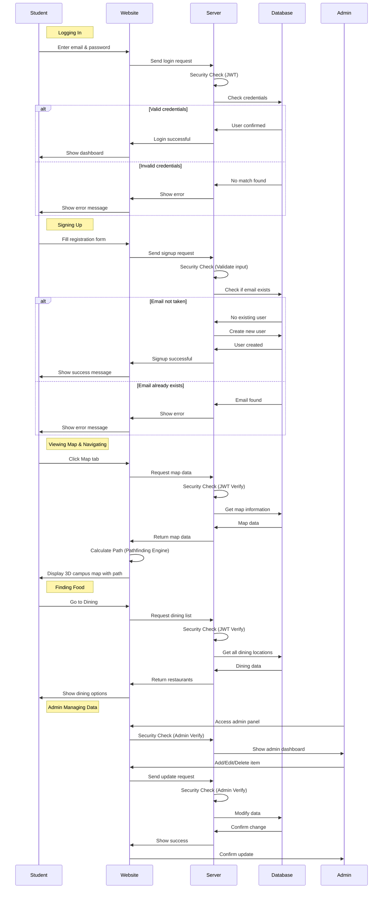
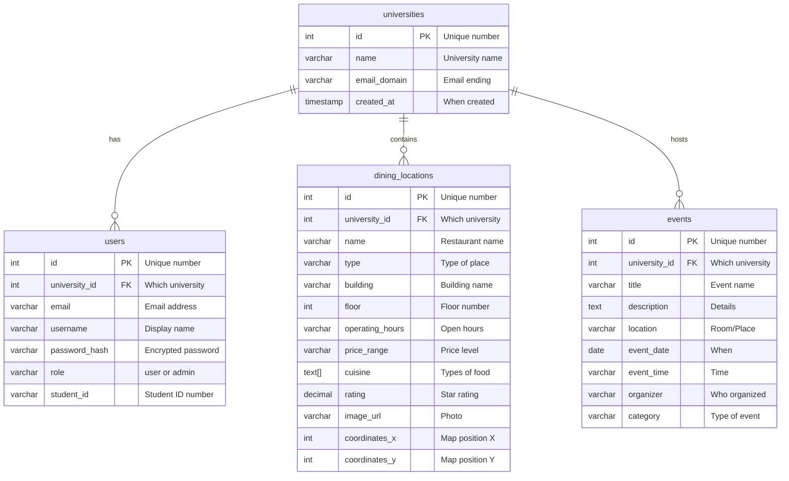
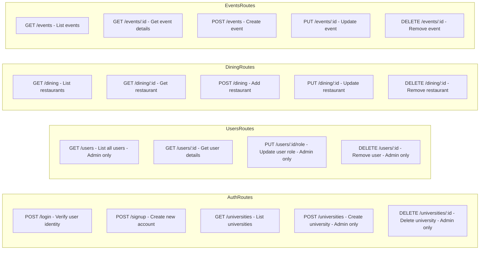
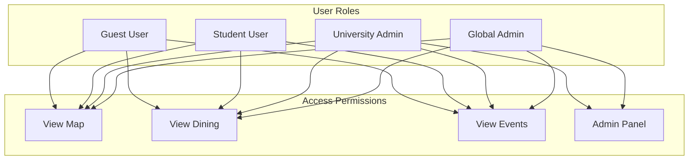

# U-Nav Project Architecture

## Overview

U-Nav is a university campus navigation app built by 1st-year Software Engineering students. It helps students find their way around campus, discover dining locations, and stay updated on campus events.

---

## High-Level Architecture

**Data Flow:**

1. User opens U-Nav in browser
2. React frontend renders UI
3. API client sends request to Express backend
4. Backend verifies JWT, queries database
5. PostgreSQL returns data
6. Frontend displays result

---

## U-Nav Architecture (Detailed)

---

## U-Nav Features

---

## Data Flow (Step by Step)

---

## Database Structure

---

## API Endpoints (What the Server Does)

---

## Technology Stack

| Layer | Technology | Key Files |
|-------|-----------|----------|
| Frontend | React 19 + TypeScript | `WebDev/src/main.tsx`, `App.tsx` |
| Build Tool | Vite 7.3 | `WebDev/vite.config.ts` |
| Backend | Express 5 + Node.js | `Backend/src/index.ts` |
| Database | PostgreSQL (Supabase) | `Backend/src/config/database.ts` |
| Security | JWT + bcryptjs | `Backend/src/routes/auth.ts`, `middleware/auth.ts` |
| Routing | React Router DOM 7 | `WebDev/src/App.tsx` |
| 3D Graphics | React Three Fiber | `src/map/3d/MapView3D.tsx`, `CampusScene.tsx` |
| Pathfinding | Custom simple | `src/map/3d/pathfinder.ts` |
| Geolocation | Browser API | `src/map/3d/geolocation.ts` |

---

## User Roles and Access

| Role | Map | Search Buildings | Dining | Events | Manage Own Univ | Manage All |
|------|-----|----------------|--------|--------|--------------|----------|
| Guest | Yes | Yes | No | No | No | No |
| Student | Yes | Yes | Yes | Yes | No | No |
| University Admin | Yes | Yes | Yes | Yes | Yes | No |
| Global Admin | Yes | Yes | Yes | Yes | Yes | Yes |

---

## Key Files Reference

| Layer | File | Purpose |
|-------|------|---------|
| **Frontend** | `WebDev/src/main.tsx` | React entry point, boots with AuthProvider |
| **Frontend** | `WebDev/src/App.tsx` | Route definitions, all pages |
| **Frontend** | `WebDev/src/api/client.ts` | Centralized fetch wrapper |
| **Frontend** | `WebDev/src/common/AuthContext.tsx` | Global auth state |
| **Frontend** | `WebDev/src/map/3d/MapView3D.tsx` | Main 3D map component |
| **Frontend** | `WebDev/src/map/3d/CampusScene.tsx` | Three.js canvas setup |
| **Frontend** | `WebDev/src/map/3d/pathfinder.ts` | Custom pathfinding |
| **Backend** | `Backend/src/index.ts` | Express server entry |
| **Backend** | `Backend/src/routes/auth.ts` | Login, signup, JWT |
| **Backend** | `Backend/src/middleware/auth.ts` | JWT verification |
| **Backend** | `Backend/src/config/database.ts` | PostgreSQL connection |
| **Database** | `Database/schema.sql` | SQL schema |

---

## Summary

**U-Nav has three layers:**

1. **React Frontend** - What users see and interact with
2. **Express Backend** - Processes requests, handles auth
3. **PostgreSQL Database** - Stores all data

**Core Features:**

- 3D Campus Map (React Three Fiber)
- Custom pathfinding algorithm
- Dining guide with filtering
- Campus events calendar
- Admin dashboard
- JWT authentication

**Built by 1st-year Software Engineering students.**
