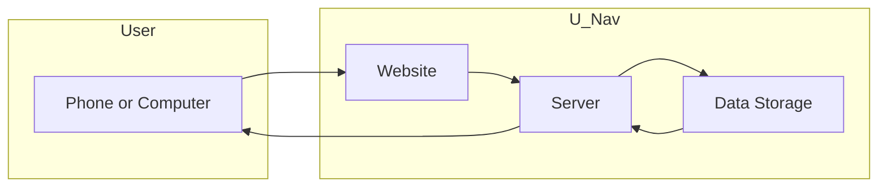
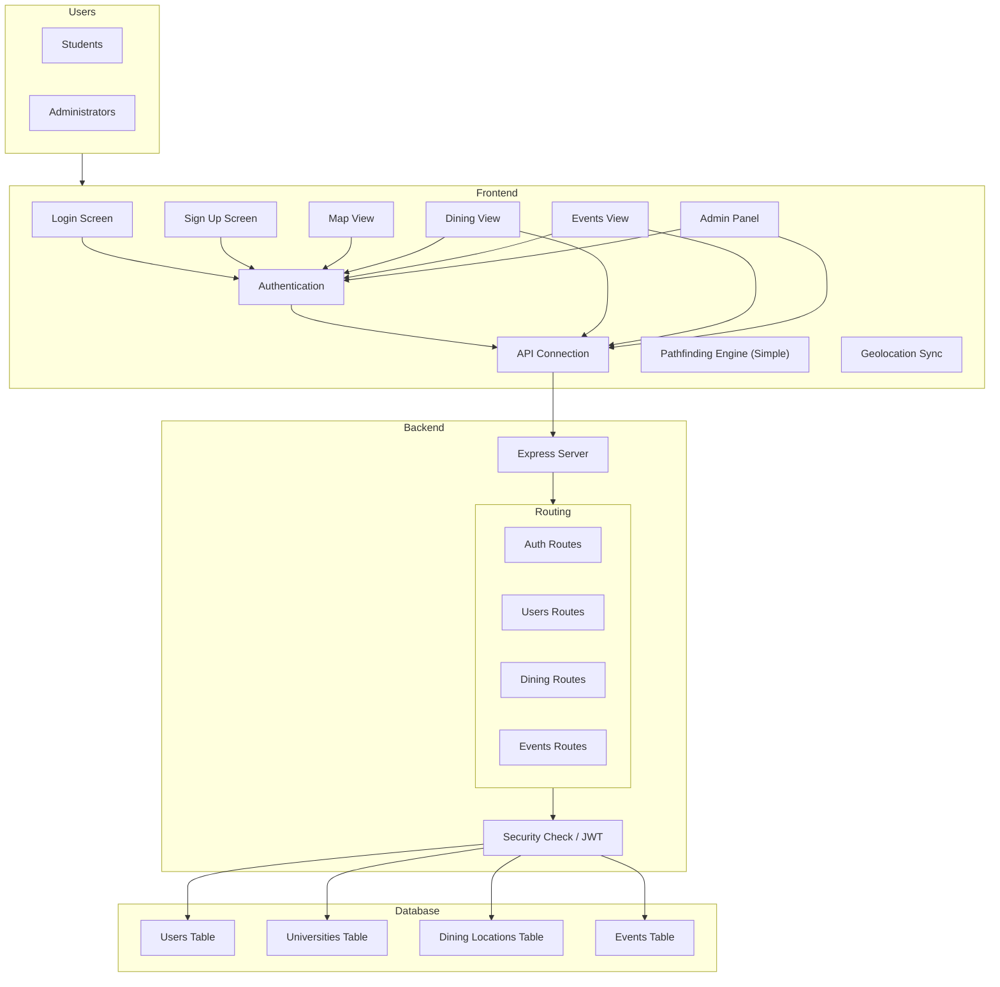
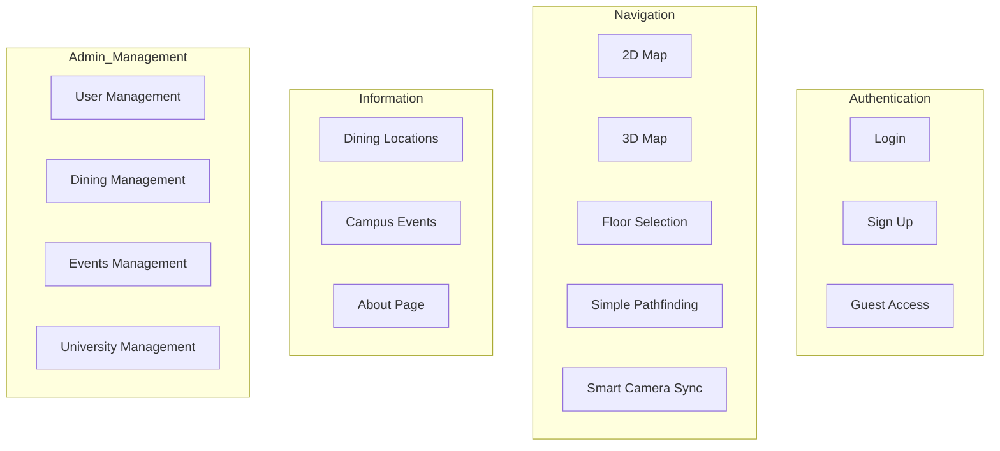
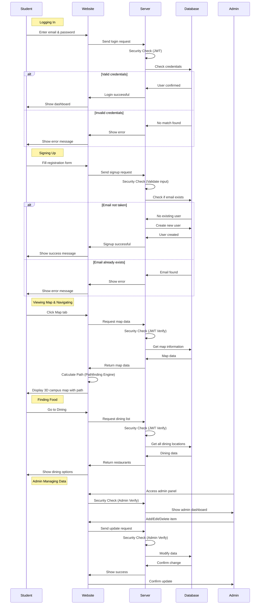
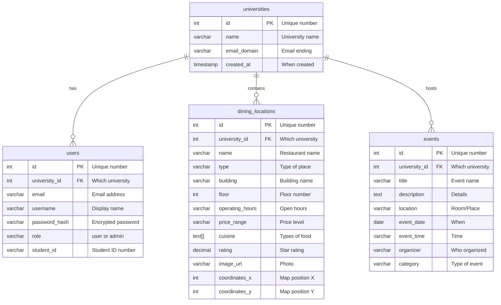
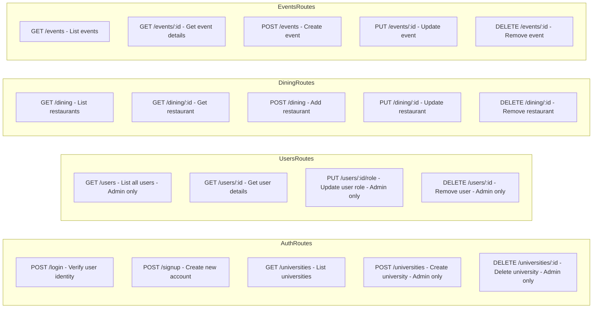
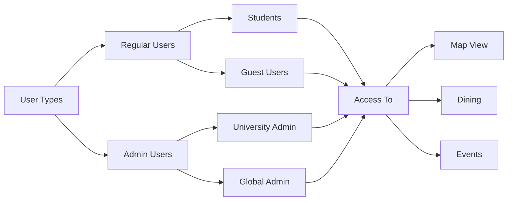

# U-Nav Project Architecture

## Overview

U-Nav is a university navigation app that helps students find their way around campus, discover dining locations, and stay updated on campus events.

---

## How U-Nav Works (Simple View)

**Simple Explanation:**

1. Student opens U-Nav on their phone or computer
2. U-Nav website sends a request to the server
3. Server checks the database for information
4. Database sends back the requested information
5. U-Nav shows it to the student

---

## U-Nav Architecture (Detailed)

---

## U-Nav Features

---

## Data Flow (Step by Step)

---

## Database Structure

---

## API Endpoints (What the Server Does)

---

## Technology Stack

| Component   | Technology            | Purpose           |
| ----------- | --------------------- | ----------------- |
| Frontend    | React + TypeScript    | Website interface |
| Build Tool  | Vite                  | Fast development  |
| Backend     | Node.js + Express     | Server logic      |
| Database    | Supabase (PostgreSQL) | Data storage      |
| Security    | JWT + bcrypt          | Authentication    |
| Routing     | React Router          | Page navigation   |
| 3D Graphics | React Three Fiber    | 3D map rendering  |
| Pathfinding | Simple Implementation | Route calculation |
| Geolocation | Browser API / Custom | Position tracking |

---

## User Types & Access

---

## Summary

**U-Nav has three main parts:**

1. **Website (Frontend)** - What students see and interact with
2. **Server (Backend)** - Handles all the logic and processing
3. **Database (Data Storage)** - Stores all the information

**Key Features:**

- 🗺️ **Maps** - 2D and 3D campus maps
- 🍔 **Dining** - Find restaurants, cafes, and food spots
- 📅 **Events** - Stay updated on campus events
- 👥 **Admin** - Manage all content easily
- 🔒 **Security** - Safe and secure authentication
